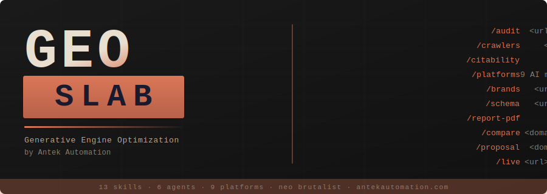

<p align="center">
  
</p>

<p align="center">
  <strong>GEO SLAB</strong> — Generative Engine Optimization, poured in concrete.<br/>
  Optimize websites for 9 AI search engines. Neo brutalist reports. No fluff.
</p>

<p align="center">
  Built by <strong>Antek Automation</strong> &mdash; <a href="https://antekautomation.com">antekautomation.com</a>
</p>

---

## Why GEO Matters (2026)

| Metric | Value |
|--------|-------|
| GEO services market | $850M+ (projected $7.3B by 2031) |
| AI-referred traffic growth | +527% year-over-year |
| AI traffic converts vs organic | 4.4x higher |
| Gartner: search traffic drop by 2028 | -50% |
| Brand mentions vs backlinks for AI | 3x stronger correlation |
| Marketers investing in GEO | Only 23% |

---

## Quick Start

### Install

```bash
git clone https://github.com/AntekAutomation/geo-slab.git
cd geo-slab
./install.sh
```

### Requirements

- Python 3.8+
- Claude Code CLI
- Git
- Optional: Playwright (for PDF reports), AI provider API keys (for live visibility testing)

---

## Commands

Open Claude Code and use these commands:

| Command | What It Does |
|---------|-------------|
| `/geo audit <url>` | Full GEO + SEO audit with parallel subagents |
| `/geo quick <url>` | 60-second GEO visibility snapshot |
| `/geo citability <url>` | Score content for AI citation readiness |
| `/geo crawlers <url>` | Check AI crawler access (robots.txt) |
| `/geo llmstxt <url>` | Analyze or generate llms.txt |
| `/geo brands <url>` | Scan brand mentions across AI-cited platforms |
| `/geo platforms <url>` | Platform-specific optimization (9 AI platforms) |
| `/geo schema <url>` | Structured data analysis & generation |
| `/geo technical <url>` | Technical SEO audit |
| `/geo content <url>` | Content quality & E-E-A-T assessment |
| `/geo report <url>` | Generate client-ready GEO report |
| `/geo report-pdf` | Generate professional PDF report with charts |
| `/geo compare <domain>` | Monthly delta tracking — compare audits over time |
| `/geo proposal <domain>` | Auto-generate client GEO service proposal |
| `/geo live <url>` | Live AI visibility test (requires API keys) |

---

## Architecture

```
geo-slab/
├── geo/                          # Main skill orchestrator
│   └── SKILL.md                  # Primary skill file with commands & routing
├── skills/                       # 13 specialized sub-skills
│   ├── geo-audit/                # Full audit orchestration & scoring
│   ├── geo-citability/           # AI citation readiness scoring
│   ├── geo-crawlers/             # AI crawler access analysis
│   ├── geo-llmstxt/              # llms.txt standard analysis & generation
│   ├── geo-brand-mentions/       # Brand presence on AI-cited platforms
│   ├── geo-platform-optimizer/   # Platform-specific AI search optimization (9 platforms)
│   ├── geo-schema/               # Structured data for AI discoverability
│   ├── geo-technical/            # Technical SEO foundations
│   ├── geo-content/              # Content quality & E-E-A-T
│   ├── geo-report/               # Client-ready markdown report generation
│   ├── geo-report-pdf/           # Professional PDF report with charts
│   ├── geo-compare/              # Monthly delta tracking
│   ├── geo-proposal/             # Client proposal generation
│   └── geo-live-visibility/      # Live AI brand visibility testing
├── agents/                       # 5 core + 1 optional subagent
│   ├── geo-ai-visibility.md      # GEO audit, citability, crawlers, brands
│   ├── geo-platform-analysis.md  # Platform-specific optimization (9 platforms)
│   ├── geo-technical.md          # Technical SEO analysis
│   ├── geo-content.md            # Content & E-E-A-T analysis
│   ├── geo-schema.md             # Schema markup analysis
│   └── geo-live-visibility.md    # Live AI brand visibility (optional, needs API keys)
├── scripts/                      # Python utilities
│   ├── fetch_page.py             # Page fetching & parsing (+ optional Firecrawl)
│   ├── citability_scorer.py      # AI citability scoring engine
│   ├── brand_scanner.py          # Brand mention detection
│   ├── llmstxt_generator.py      # llms.txt validation & generation
│   ├── render_geo_report.py      # Neo brutalist HTML report generator
│   ├── generate_pdf_report.py    # PDF report generator (Playwright)
│   ├── generate_prospect_report.py # Prospect/lite HTML report
│   └── live_ai_query.py          # Live AI visibility querying
├── schema/                       # JSON-LD templates
│   ├── organization.json         # Organization schema
│   ├── local-business.json       # LocalBusiness schema
│   ├── article-author.json       # Article + Person schema (E-E-A-T)
│   ├── software-saas.json        # SoftwareApplication schema
│   ├── product-ecommerce.json    # Product schema with offers
│   └── website-searchaction.json # WebSite + SearchAction schema
├── install.sh                    # Installer
├── uninstall.sh                  # Uninstaller
├── requirements.txt              # Python dependencies
└── README.md
```

---

## How It Works

### Full Audit Flow

When you run `/geo audit https://example.com`:

1. **Discovery** — Fetches homepage, detects business type, crawls sitemap
2. **Parallel Analysis** — Launches 5 core subagents simultaneously:
   - AI Visibility (citability, crawlers, llms.txt, brand mentions)
   - Platform Analysis (9 AI platforms: AIO, ChatGPT, Perplexity, Gemini, Copilot, Grok, DeepSeek, Meta AI, Mistral)
   - Technical SEO (Core Web Vitals, SSR, security, mobile)
   - Content Quality (E-E-A-T, readability, freshness)
   - Schema Markup (detection, validation, generation)
   - *Optional:* Live AI Visibility (queries AI APIs directly if keys configured)
3. **Synthesis** — Aggregates scores, generates composite GEO Score (0-100)
4. **Report** — Outputs prioritized action plan with quick wins

### Scoring Methodology

| Category | Weight |
|----------|--------|
| AI Citability & Visibility | 25% |
| Brand Authority Signals | 20% |
| Content Quality & E-E-A-T | 20% |
| Technical Foundations | 15% |
| Structured Data | 10% |
| Platform Optimization | 10% |

---

## Key Features

### 9-Platform Optimization
Covers Google AI Overviews, ChatGPT, Perplexity, Gemini, Bing Copilot, Grok (xAI), DeepSeek, Meta AI, and Mistral (Le Chat). Each platform gets its own scoring rubric and optimization checklist.

### Live AI Visibility Testing
Queries ChatGPT, Claude, Gemini, and Perplexity directly with contextual prompts to measure real-time brand visibility. Discovers competitors and calculates share of voice. Requires AI provider API keys.

### Monthly Delta Tracking
Compare two audit snapshots with `/geo compare` to show clients exactly what improved, what declined, and what to focus on next. Essential for demonstrating ROI.

### Client Proposal Generation
Auto-generate professional GEO service proposals from audit data with `/geo proposal`. Includes tiered pricing recommendations based on GEO score severity.

### Neo Brutalist Reports
Professional HTML and PDF reports with the neo brutalist design language — coral/cream/sage palette, Barlow Condensed headings, clean data visualizations. Client-ready out of the box.

### Firecrawl Integration
Optional Firecrawl API support for scraping JavaScript-heavy sites. Set `FIRECRAWL_API_KEY` and the toolkit automatically uses Firecrawl for content extraction with full JS rendering.

### Citability Scoring
Analyzes content blocks for AI citation readiness. Optimal AI-cited passages are 134-167 words, self-contained, fact-rich, and directly answer questions.

### AI Crawler Analysis
Checks robots.txt for 14+ AI crawlers (GPTBot, ClaudeBot, PerplexityBot, FacebookBot, etc.) and provides specific allow/block recommendations.

### Brand Mention Scanning
Brand mentions correlate 3x more strongly with AI visibility than backlinks. Scans YouTube, Reddit, Wikipedia, X/Twitter, LinkedIn, and 7+ other platforms.

### llms.txt Generation
Generates the emerging llms.txt standard file that helps AI crawlers understand your site structure.

---

## Optional Setup

### Live AI Visibility Testing

```bash
# Install one or more AI provider SDKs
pip install openai anthropic google-generativeai

# Set API keys (add to .env or export)
export OPENAI_API_KEY="sk-..."
export ANTHROPIC_API_KEY="sk-ant-..."
export GOOGLE_GENERATIVE_AI_API_KEY="..."
export PERPLEXITY_API_KEY="pplx-..."
```

### Firecrawl (JS-Heavy Sites)

```bash
pip install firecrawl-py
export FIRECRAWL_API_KEY="fc-..."
```

---

## Uninstall

```bash
./uninstall.sh
```

---

## Documentation

Deeper technical reference lives in [`docs/`](docs/):

- [`docs/architecture.md`](docs/architecture.md) — system design, audit flow, parallel agent orchestration
- [`docs/scoring-methodology.md`](docs/scoring-methodology.md) — composite GEO Score formula, per-category weightings
- [`docs/skills-and-agents.md`](docs/skills-and-agents.md) — full inventory of skills, agents, scripts, schemas
- [`docs/commands-reference.md`](docs/commands-reference.md) — every `/geo` slash command

## Web Dashboard

GEO SLAB ships with a browser CRM for managing prospects, notes, and audit artifacts. Vanilla Flask + HTMX, neo brutalist palette to match the report PDFs.

```bash
cd webapp && pip install -r requirements-webapp.txt && python app.py
# → http://localhost:5050
```

Or invoke `/geo dashboard` inside Claude Code for launch instructions. The dashboard auto-discovers existing audit artifacts under `reports/<domain>/` and persists prospects to `~/.geo-slab/prospects.json`.

See [`webapp/README.md`](webapp/README.md) for routes and data model.

## Examples

Sample audit JSON, HTML report, and PDF live in [`examples/`](examples/) for testing report renderers and showing prospects what a finished deliverable looks like.

---

## License

MIT License

---

**GEO SLAB** by Antek Automation. Built for the AI search era.
[antekautomation.com](https://antekautomation.com)
